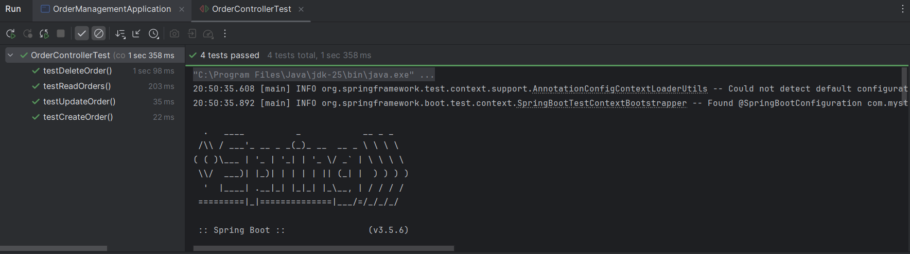
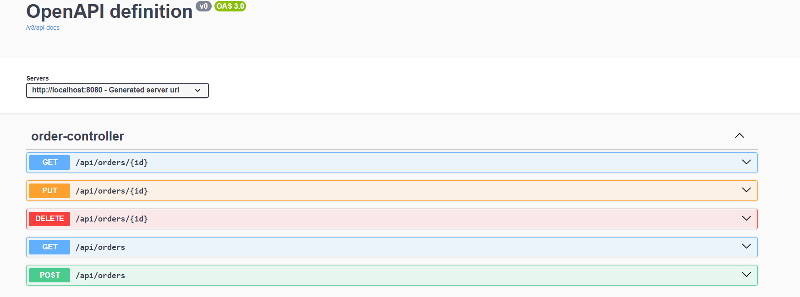
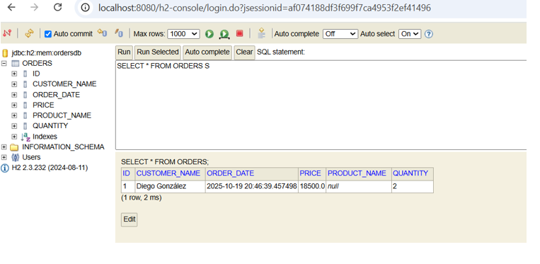
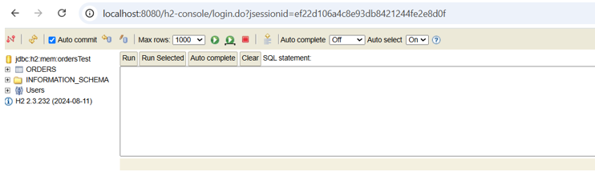
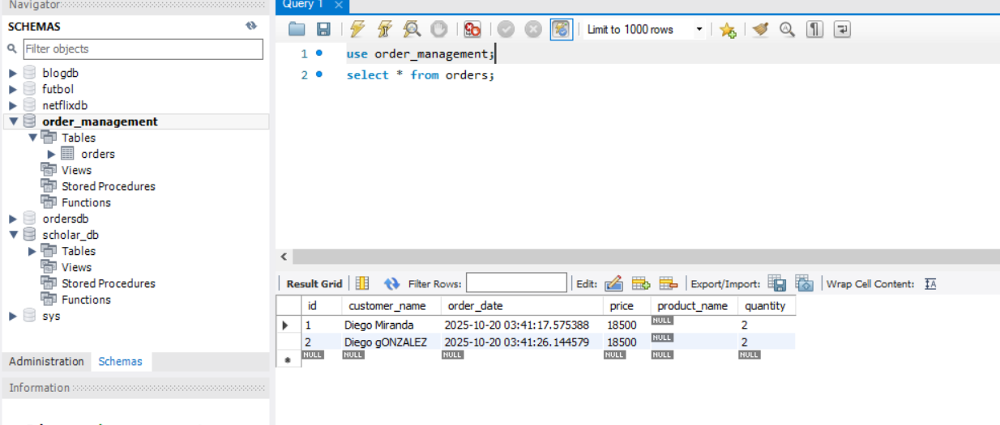

# 🧩 Order Management System (CRUD with Spring Boot, H2, and MySQL)

This project is a CRUD system (Create, Read, Update, Delete) built with **Spring Boot**.  
It manages records in a relational database and includes **three environment profiles**: development, testing, and production.  
It also integrates **Swagger** for API documentation and **JUnit tests** for validation.

---

## 📚 Table of Contents

- [🧠 General Description](#-general-description)
- [⚙️ Technologies Used](#-technologies-used)
- [📦 Main Dependencies](#-main-dependencies)
- [🧱 Project Structure](#-project-structure)
- [🖥️ How to Clone](#️-how-to-clone)
- [▶️ How to Run](#️-how-to-run)
- [🌐 Environment Profiles](#-environment-profiles)
- [⚡ CRUD Explanation and Filters](#-crud-explanation-and-filters)
- [🧩 H2 Database](#-h2-database)
- [🧪 Unit Testing](#-unit-testing)
- [🧭 Swagger Documentation](#-swagger-documentation)
- [🖼️ Profile Screenshots](#-profile-screenshots)
- [🚀 What Was Implemented](#-what-was-implemented)
- [🏁 Sprint 3 Delivery](#-sprint-3-delivery)
- [✍️ Credits](#-credits)

---

## 🧠 General Description

This web application was developed with **Spring Boot** and performs CRUD operations on a database.

- **Sprint 1:** Implemented CRUD and connected H2 database.
- **Sprint 2:** Added environment profiles (dev, test, prod).
- **Sprint 3:** Added Swagger documentation and unit tests.

The system allows managing records (like orders, products, or users) and switching databases depending on the environment.

---

## ⚙️ Technologies Used

| Type | Technology |
|------|-------------|
| Language | Java 17 |
| Framework | Spring Boot 3.x |
| In-memory database | H2 |
| Persistent database | MySQL |
| Templates | Thymeleaf |
| Documentation | Swagger (Springdoc OpenAPI) |
| Testing | JUnit & Mockito |
| Build tool | Maven |
| IDE | IntelliJ IDEA |
| Version control | Git / GitHub |

---

## 📦 Main Dependencies

```xml
<dependencies>
    <dependency>
        <groupId>org.springframework.boot</groupId>
        <artifactId>spring-boot-starter-web</artifactId>
    </dependency>
    <dependency>
        <groupId>org.springframework.boot</groupId>
        <artifactId>spring-boot-starter-thymeleaf</artifactId>
    </dependency>
    <dependency>
        <groupId>org.springframework.boot</groupId>
        <artifactId>spring-boot-starter-data-jpa</artifactId>
    </dependency>
    <dependency>
        <groupId>com.h2database</groupId>
        <artifactId>h2</artifactId>
        <scope>runtime</scope>
    </dependency>
    <dependency>
        <groupId>mysql</groupId>
        <artifactId>mysql-connector-j</artifactId>
        <scope>runtime</scope>
    </dependency>
    <dependency>
        <groupId>org.springdoc</groupId>
        <artifactId>springdoc-openapi-starter-webmvc-ui</artifactId>
        <version>2.3.0</version>
    </dependency>
    <dependency>
        <groupId>org.springframework.boot</groupId>
        <artifactId>spring-boot-starter-test</artifactId>
        <scope>test</scope>
    </dependency>
</dependencies>
```

---

## 🧱 Project Structure

```
src/
 ├── main/
 │   ├── java/com/example/demo/
 │   │   ├── controller/
 │   │   │   └── ItemController.java
 │   │   ├── model/
 │   │   │   └── Item.java
 │   │   ├── repository/
 │   │   │   └── ItemRepository.java
 │   │   ├── service/
 │   │   │   └── ItemService.java
 │   │   └── DemoApplication.java
 │   └── resources/
 │       ├── application.properties
 │       ├── application-dev.properties
 │       ├── application-test.properties
 │       └── application-prod.properties
 └── test/
     ├── controller/
     │   └── ItemControllerTest.java
     └── service/
         └── ItemServiceTest.java
```

---

## 🖥️ How to Clone

```bash
git clone https://github.com/yourusername/order-management-system.git
cd order-management-system
```

---

## ▶️ How to Run

### Development mode (default)
```bash
mvn spring-boot:run
```

### Production mode
```bash
mvn spring-boot:run -Dspring-boot.run.profiles=prod
```

### Run tests
```bash
mvn test
```

---

## 🌐 Environment Profiles

| Profile | File | Database | Purpose |
|----------|------|-----------|----------|
| dev | application-dev.properties | H2 | Local development |
| test | application-test.properties | H2 | Unit testing |
| prod | application-prod.properties | MySQL | Production |

### Change active profile
Edit in `application.properties`:
```properties
spring.profiles.active=prod
```
or run with:
```bash
mvn spring-boot:run -Dspring-boot.run.profiles=test
```

---

## ⚡ CRUD Explanation and Filters

| Operation | HTTP Method | Endpoint | Description |
|------------|--------------|-----------|--------------|
| Create | POST | /items | Add a new record |
| Read | GET | /items | Get all records |
| Read by ID | GET | /items/{id} | Get record filtered by ID |
| Update | PUT | /items/{id} | Update a record |
| Delete | DELETE | /items/{id} | Delete record by ID |

All endpoints are functional and include **ID filters**.

---

## 🧩 H2 Database

H2 is an in-memory database used for development and testing — no installation required.

Access the console:
```
http://localhost:8080/h2-console
```

Use connection details from your active profile, for example:
```
jdbc:h2:mem:testdb
```

⚠️ When the server stops, data is deleted automatically. This makes testing fast and clean.

---

## 🧪 Unit Testing

Unit tests are implemented with **JUnit** and **Mockito**.  
They validate:
- Service layer CRUD logic
- Controller endpoints with mock requests

To run all tests:
```bash
mvn test
```



The **test profile (H2)** is automatically used during testing.

---

## 🧭 Swagger Documentation

Swagger UI is integrated using **Springdoc OpenAPI**.  
Access it at:
```
http://localhost:8080/swagger-ui.html
```



You can visualize and test all endpoints directly from the browser.

---

## 🖼️ Profile Screenshots

**Development (H2)**  


**Testing (H2)**  


**Production (MySQL)**  


---

## 🚀 What Was Implemented

| Sprint | Goal | Deliverables | Result |
|--------|------|---------------|---------|
| 1 | CRUD and H2 connection | CRUD + H2 database | ✅ Completed |
| 2 | Environment profiles | Dev, Test, Prod profiles | ✅ Completed |
| 3 | Swagger + Unit Tests | Documentation + Tests + README update | ✅ Completed |

---

## 🏁 Sprint 3 Delivery

✅ Functional CRUD with ID filters  
✅ Three environment profiles (dev, test, prod)  
✅ Databases: H2 (dev/test) and MySQL (prod)  
✅ Unit tests for controller and service layers  
✅ Swagger API documentation integrated  
✅ Full technical documentation

---

## ✍️ Credits

**Developed by:** Diego González Miranda  
**License:** Free to use  
**Version:** Sprint 3 – October 2025
